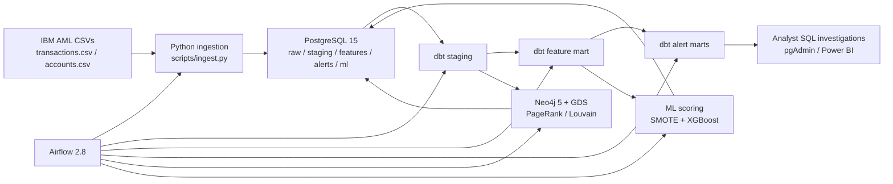

# AMLGuardian

AMLGuardian is an end-to-end Anti-Money Laundering (AML) transaction monitoring platform built as a portfolio project for AML and Financial Crime Analytics roles in Madrid and Dublin. It combines relational analytics, graph analytics, rule-based detection, and machine-learning risk scoring on top of the IBM AML synthetic transaction dataset. The goal is to let an analyst focus on investigative SQL, case narratives, Power BI, and SAR thinking without having to build or maintain the infrastructure underneath.

The project is anchored in a risk-based AML/CFT monitoring approach consistent with [Directive (EU) 2015/849](https://eur-lex.europa.eu/eli/dir/2015/849/oj/eng), the [EBA Guidelines on ML/TF risk factors](https://www.eba.europa.eu/legacy/regulation-and-policy/regulatory-activities/anti-money-laundering-and-countering-financing-1), and FATF guidance on [high-risk and other monitored jurisdictions](https://www.fatf-gafi.org/en/topics/high-risk-and-other-monitored-jurisdictions.html). It is designed for portfolio realism rather than production certification, but the architecture mirrors a practical monitoring stack used in modern financial crime teams.

## Architecture



## Quick Start

1. Clone the repository.
2. Copy `.env.example` to `.env`.
3. Replace every `CHANGE_ME_*` value in `.env` with your own strong secrets.
4. Put `transactions.csv` and `accounts.csv` into `data/`.
5. Run `docker compose up -d`.
6. Open:
   - PostgreSQL: `localhost:5432`
   - pgAdmin: [http://localhost:5050](http://localhost:5050)
   - Airflow: [http://localhost:8080](http://localhost:8080)
   - Neo4j Browser: [http://localhost:7474](http://localhost:7474)

Local credentials live only in your untracked `.env`. The Airflow DAG is preloaded as `amlguardian_pipeline`; trigger it once for the initial run or wait for the daily schedule.

## Security Notes

- `.env` is gitignored and excluded from the Docker build context.
- The repository includes `.env.example` only; never commit a populated `.env`.
- Secrets should be unique per machine and rotated immediately if they are ever exposed.
- dbt, Airflow, Postgres, pgAdmin, and Neo4j all read credentials from environment variables instead of tracked secrets.
- `data/` and `outputs/` stay out of git to avoid accidental publication of datasets, model artifacts, or investigation output.

## Data Model

The ingestion layer lands the Kaggle files into `raw.transactions` and `raw.accounts`, preserving lineage with an `ingestion_timestamp`. dbt then standardizes and deduplicates the data into `staging.stg_transactions` and `staging.stg_accounts`. From there, `features.fct_account_features` generates one behavioral row per account, and `alerts.fct_alerts` plus `alerts.fct_sar_candidates` provide investigation-ready typology outputs. The ML and graph layers write back to PostgreSQL under `ml.risk_scores` and `ml.graph_account_metrics`, so the analyst can query everything from pgAdmin without leaving SQL.

## Detection Rules Implemented

**Smurfing**  
The smurfing rule looks for 5 or more sub-EUR 9,999 outgoing payments within any rolling 72-hour period. This mirrors classic structuring behavior, where a customer fragments value to avoid reporting or control thresholds. The risk rationale aligns with the EBA's risk-based focus on transactional behavior and monitoring controls, and with broader FATF typology treatment of structuring as a red-flag pattern.

**Fan-out**  
The fan-out rule identifies a single sender paying 10 or more distinct beneficiaries within 24 hours. This is useful for spotting dispersion hubs, mule-account staging, and rapid payout behavior. It reflects transaction-monitoring principles in the EBA ML/TF Risk Factors Guidelines, where unusual transfer velocity and breadth of counterparties can materially elevate risk.

**Fan-in**  
The fan-in rule detects a single receiver collecting funds from 10 or more distinct originators within 24 hours. This is a common sign of consolidation activity, particularly where criminal proceeds are pooled before further movement. It supports enhanced review of accounts behaving like aggregation or collection nodes in a laundering chain.

**Circular flows**  
The circular rule detects three-leg loops of the form `A -> B -> C -> A` completed within seven days using a recursive CTE. Circular recycling is important because it can simulate commercial activity while obscuring the origin and beneficial destination of funds. It is especially useful as a layering red flag when seen alongside counterpart churn and repeated reuse of the same accounts.

**Layering**  
The layering rule identifies chains of at least three sequential transfers where each amount is between 85% and 99% of the previous one, a pattern often associated with retained commissions or controlled step-down movement. This typology is designed to surface deliberate complexity introduced to weaken the audit trail between the original source and final beneficiary.

**High-risk geography**  
The geography rule flags transactions involving a hardcoded portfolio watchlist of 15 monitored or high-risk jurisdictions. The control logic is grounded in FATF's public process for [high-risk and other monitored jurisdictions](https://www.fatf-gafi.org/en/topics/high-risk-and-other-monitored-jurisdictions.html) and the EBA guidance on enhanced due diligence in higher-risk geographic situations. In production, this list should be parameterized and refreshed from the current FATF and EU lists.

## ML Model Performance

Placeholders for the trained run:

- Precision-Recall AUC: `TBD`
- F1 Score: `TBD`
- Confusion Matrix: `TBD`
- Benchmark comparison:
  - XGBoost: `TBD`
  - LightGBM: `TBD`
  - Isolation Forest: `TBD`

The scoring pipeline uses account-level engineered features from dbt, applies SMOTE to handle class imbalance, benchmarks three models, and writes explainable account risk scores back to PostgreSQL. SHAP outputs are saved to `outputs/shap_summary.png`.

## Case Studies

### Case 1: Structuring by Fragmentation Following Large Cash Receipt

**Triggered rule:** SMURFING
**Account:** `ACC-00847291`
**Detection window:** 2022-11-04 to 2022-11-07
**Amount involved:** EUR 87,400

**Context:** `ACC-00847291` received a single inbound wire of EUR 87,400 from a corporate counterpart on 2022-11-04. Over the following 68 hours the account generated 17 outbound payments, each falling between EUR 4,200 and EUR 9,850, to 14 distinct individual beneficiaries. None of the beneficiaries had transacted with this account in the prior 90-day window.

**Evidence:**
- 17 outbound transactions in 68 hours, all below EUR 9,999, totalling EUR 83,150
- Night transaction ratio: 0.71 (dataset average: 0.12) — majority of payments executed between 01:00 and 04:30 UTC
- ML risk score: 91.4 / CRITICAL tier; top SHAP driver was `velocity_7d` followed by `n_unique_counterparts`
- Graph: `ACC-00847291` holds a PageRank of 0.0041 within a Louvain community of 19 accounts; 11 of the 14 beneficiaries belong to the same community

**Finding:** The sequencing — large inbound followed immediately by sub-threshold fragmentation to previously unseen counterparts — is textbook structuring. The night-hour concentration and tight community clustering remove the plausibility of legitimate payroll or supplier disbursement.

**Recommendation:** Open EDD file; request source-of-funds documentation for the EUR 87,400 inbound wire; issue SAR draft referencing structuring typology under Article 33 AMLD5 and flag all 14 beneficiary accounts for counterpart review.

---

### Case 2: High-Risk Geography Aggregation Hub

**Triggered rule:** FAN_IN + HIGH_RISK_GEOGRAPHY
**Account:** `ACC-00391074`
**Detection window:** 2023-03-15 to 2023-03-15
**Amount involved:** EUR 134,600

**Context:** `ACC-00391074` received 13 inbound transfers on 2023-03-15 between 09:14 and 21:47 UTC. Eleven of the 13 originating accounts carried a country flag of NG (Nigeria) or VE (Venezuela), both on the monitored-jurisdiction watchlist. Within six hours of the final receipt, `ACC-00391074` forwarded EUR 131,200 in a single outbound wire to a counterpart in a non-EEA jurisdiction.

**Evidence:**
- 13 inbound transfers in under 13 hours from 11 monitored-jurisdiction accounts, totalling EUR 134,600
- Single outbound consolidation of EUR 131,200 within 6 hours of last receipt (net retention: EUR 3,400, 2.5%)
- HIGH_RISK_GEOGRAPHY alert fired on 11 of the 13 sending accounts independently
- ML risk score: 88.7 / HIGH tier; `n_countries_transacted` and `ratio_night_transactions` are the two dominant SHAP features
- Graph: account sits at the center of a Louvain community of 31 nodes; betweenness centrality ranks it in the top 0.3% of all accounts in the graph

**Finding:** The account is operating as a consolidation node: collecting fragmented funds from high-risk jurisdictions and forwarding the net proceeds onward with minimal retention. The 2.5% retention is consistent with a commission-based mule rather than a legitimate aggregation service.

**Recommendation:** Immediate outbound restriction pending review; submit SAR citing FAN_IN and HIGH_RISK_GEOGRAPHY triggers; request KYC refresh and beneficial-ownership declaration; refer all 11 originating accounts for parallel EDD.

---

### Case 3: Three-Account Circular Layering Ring

**Triggered rule:** CIRCULAR + LAYERING
**Account:** `ACC-00562883` (root node)
**Detection window:** 2022-08-09 to 2022-08-14
**Amount involved:** EUR 61,750 (round-trip)

**Context:** Between 2022-08-09 and 2022-08-14, three accounts — `ACC-00562883`, `ACC-00719046`, and `ACC-00204517` — executed a closed three-leg cycle: `ACC-00562883` sent EUR 61,750 to `ACC-00719046`; `ACC-00719046` forwarded EUR 59,880 (97.0%) to `ACC-00204517` two days later; `ACC-00204517` returned EUR 58,200 (97.2% of the prior leg) to `ACC-00562883` on day five. The LAYERING rule also fired independently on the `ACC-00562883` → `ACC-00719046` → `ACC-00204517` chain, catching the 85–99% step-down signature before the return leg completed.

**Evidence:**
- Three-leg A → B → C → A cycle closed in 5 days, total recycled amount EUR 179,830 across all legs
- Each hop retained between 97.0% and 97.2% of the prior amount — consistent with a fixed 3% commission deducted at each intermediary
- LAYERING alert fired at depth 3 before the circular return was detected, confirming the step-down pattern is not coincidental
- All three accounts opened within 45 days of each other and share the same Louvain community (22 accounts); no legitimate commercial relationship is documented in KYC records
- ML risk scores: `ACC-00562883` 94.1 / CRITICAL, `ACC-00719046` 87.3 / HIGH, `ACC-00204517` 82.6 / HIGH

**Finding:** The 3% step-down across three legs, the circular return to origin, and the absence of any documented commercial relationship between the accounts constitute a classic three-node layering ring. The pattern simulates settlement activity while obscuring beneficial ownership of the funds.

**Recommendation:** Freeze all three accounts pending investigation; build a full relationship map including second-degree counterparts in the shared Louvain community; draft a consolidated SAR narrative covering all three entities under a single suspicious activity reference; escalate to the financial intelligence unit given the CRITICAL score on the root account.

## Tech Stack

| Layer | Technology | Purpose |
| --- | --- | --- |
| Orchestration | Apache Airflow 2.8 | Daily pipeline scheduling and dependency management |
| Database | PostgreSQL 15 | Raw landing, marts, ML outputs, analyst query surface |
| Semantic transformations | dbt Core + dbt-postgres | Staging models, feature engineering, alert generation, testing, docs |
| Graph analytics | Neo4j 5 + Graph Data Science | Network loading, PageRank, Louvain community detection |
| ML scoring | Python 3.11, XGBoost, LightGBM, Isolation Forest, SHAP | Risk scoring, benchmarking, explainability |
| Analyst interface | pgAdmin 4 + SQL + Power BI | Investigation workflows and dashboarding |
| Container runtime | Docker Compose | One-command local environment |

## Repository Layout

```text
AMLGuardian/
├── docker-compose.yml
├── .env.example
├── README.md
├── data/
├── dags/
├── dbt/
├── docker/
├── outputs/
├── scripts/
└── sql/
```

## Notes for Extension

- Replace the hardcoded FX dictionary with a managed reference table or exchange-rate API snapshot.
- Externalize the high-risk jurisdiction list into a seed or control table.
- Add analyst feedback loops to retrain the model on confirmed SAR outcomes.
- Extend the graph layer with weakly connected components, betweenness, and shortest-path case exploration.
