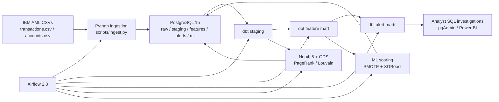

# AMLGuardian

AMLGuardian is an end-to-end Anti-Money Laundering (AML) transaction monitoring platform built as a portfolio project for AML and Financial Crime Analytics roles in Madrid and Dublin. It combines relational analytics, graph analytics, rule-based detection, and machine-learning risk scoring on top of the IBM AML synthetic transaction dataset. The goal is to let an analyst focus on investigative SQL, case narratives, Power BI, and SAR thinking without having to build or maintain the infrastructure underneath.

The project is anchored in a risk-based AML/CFT monitoring approach consistent with [Directive (EU) 2015/849](https://eur-lex.europa.eu/eli/dir/2015/849/oj/eng), the [EBA Guidelines on ML/TF risk factors](https://www.eba.europa.eu/legacy/regulation-and-policy/regulatory-activities/anti-money-laundering-and-countering-financing-1), and FATF guidance on [high-risk and other monitored jurisdictions](https://www.fatf-gafi.org/en/topics/high-risk-and-other-monitored-jurisdictions.html). It is designed for portfolio realism rather than production certification, but the architecture mirrors a practical monitoring stack used in modern financial crime teams.

## Architecture



## Quick Start

1. Clone the repository.
2. Copy `.env.example` to `.env`.
3. Replace every `CHANGE_ME_*` value in `.env` with your own strong secrets.
4. Put `transactions.csv` and `accounts.csv` into `data/`.
5. Run `docker compose up -d`.
6. Open:
   - PostgreSQL: `localhost:5432`
   - pgAdmin: [http://localhost:5050](http://localhost:5050)
   - Airflow: [http://localhost:8080](http://localhost:8080)
   - Neo4j Browser: [http://localhost:7474](http://localhost:7474)

Local credentials live only in your untracked `.env`. The Airflow DAG is preloaded as `amlguardian_pipeline`; trigger it once for the initial run or wait for the daily schedule.

## Security Notes

- `.env` is gitignored and excluded from the Docker build context.
- The repository includes `.env.example` only; never commit a populated `.env`.
- Secrets should be unique per machine and rotated immediately if they are ever exposed.
- dbt, Airflow, Postgres, pgAdmin, and Neo4j all read credentials from environment variables instead of tracked secrets.
- `data/` and `outputs/` stay out of git to avoid accidental publication of datasets, model artifacts, or investigation output.

## Data Model

The ingestion layer lands the Kaggle files into `raw.transactions` and `raw.accounts`, preserving lineage with an `ingestion_timestamp`. dbt then standardizes and deduplicates the data into `staging.stg_transactions` and `staging.stg_accounts`. From there, `features.fct_account_features` generates one behavioral row per account, and `alerts.fct_alerts` plus `alerts.fct_sar_candidates` provide investigation-ready typology outputs. The ML and graph layers write back to PostgreSQL under `ml.risk_scores` and `ml.graph_account_metrics`, so the analyst can query everything from pgAdmin without leaving SQL.

## Detection Rules Implemented

**Smurfing**  
The smurfing rule looks for 5 or more sub-EUR 9,999 outgoing payments within any rolling 72-hour period. This mirrors classic structuring behavior, where a customer fragments value to avoid reporting or control thresholds. The risk rationale aligns with the EBA's risk-based focus on transactional behavior and monitoring controls, and with broader FATF typology treatment of structuring as a red-flag pattern.

**Fan-out**  
The fan-out rule identifies a single sender paying 10 or more distinct beneficiaries within 24 hours. This is useful for spotting dispersion hubs, mule-account staging, and rapid payout behavior. It reflects transaction-monitoring principles in the EBA ML/TF Risk Factors Guidelines, where unusual transfer velocity and breadth of counterparties can materially elevate risk.

**Fan-in**  
The fan-in rule detects a single receiver collecting funds from 10 or more distinct originators within 24 hours. This is a common sign of consolidation activity, particularly where criminal proceeds are pooled before further movement. It supports enhanced review of accounts behaving like aggregation or collection nodes in a laundering chain.

**Circular flows**  
The circular rule detects three-leg loops of the form `A -> B -> C -> A` completed within seven days using a recursive CTE. Circular recycling is important because it can simulate commercial activity while obscuring the origin and beneficial destination of funds. It is especially useful as a layering red flag when seen alongside counterpart churn and repeated reuse of the same accounts.

**Layering**  
The layering rule identifies chains of at least three sequential transfers where each amount is between 85% and 99% of the previous one, a pattern often associated with retained commissions or controlled step-down movement. This typology is designed to surface deliberate complexity introduced to weaken the audit trail between the original source and final beneficiary.

**High-risk geography**  
The geography rule flags transactions involving a hardcoded portfolio watchlist of 15 monitored or high-risk jurisdictions. The control logic is grounded in FATF's public process for [high-risk and other monitored jurisdictions](https://www.fatf-gafi.org/en/topics/high-risk-and-other-monitored-jurisdictions.html) and the EBA guidance on enhanced due diligence in higher-risk geographic situations. In production, this list should be parameterized and refreshed from the current FATF and EU lists.

## ML Model Performance

Placeholders for the trained run:

- Precision-Recall AUC: `TBD`
- F1 Score: `TBD`
- Confusion Matrix: `TBD`
- Benchmark comparison:
  - XGBoost: `TBD`
  - LightGBM: `TBD`
  - Isolation Forest: `TBD`

The scoring pipeline uses account-level engineered features from dbt, applies SMOTE to handle class imbalance, benchmarks three models, and writes explainable account risk scores back to PostgreSQL. SHAP outputs are saved to `outputs/shap_summary.png`.

## Case Studies

### Case 1: Structured Cash-Out Network

- Context: A customer sends repeated low-value transfers to a cluster of newly created recipients over three days.
- Evidence: Smurfing alert, elevated night-transaction ratio, and medium PageRank concentration.
- Finding: Pattern is consistent with structuring followed by staged dispersion.
- Recommendation: Escalate for EDD, source-of-funds review, and SAR decisioning.

### Case 2: Mule Collection Account

- Context: A receiver account consolidates funds from many originators in less than 24 hours and forwards them onward.
- Evidence: Fan-in alert, high ML score, and strong graph centrality within one Louvain community.
- Finding: Account behaves like a collection mule or pooling node.
- Recommendation: Freeze outbound review threshold, investigate linked counterparties, and prepare escalation notes.

### Case 3: Circular Layering Ring

- Context: Funds cycle through three connected parties and return close to the origin amount within one week.
- Evidence: Circular-flow alert, layering alert, and repeated counterpart overlap.
- Finding: The movement suggests deliberate laundering choreography rather than legitimate settlement.
- Recommendation: Build a relationship map, review KYC consistency, and draft a SAR narrative.

## Tech Stack

| Layer | Technology | Purpose |
| --- | --- | --- |
| Orchestration | Apache Airflow 2.8 | Daily pipeline scheduling and dependency management |
| Database | PostgreSQL 15 | Raw landing, marts, ML outputs, analyst query surface |
| Semantic transformations | dbt Core + dbt-postgres | Staging models, feature engineering, alert generation, testing, docs |
| Graph analytics | Neo4j 5 + Graph Data Science | Network loading, PageRank, Louvain community detection |
| ML scoring | Python 3.11, XGBoost, LightGBM, Isolation Forest, SHAP | Risk scoring, benchmarking, explainability |
| Analyst interface | pgAdmin 4 + SQL + Power BI | Investigation workflows and dashboarding |
| Container runtime | Docker Compose | One-command local environment |

## Repository Layout

```text
AMLGuardian/
├── docker-compose.yml
├── .env.example
├── README.md
├── data/
├── dags/
├── dbt/
├── docker/
├── outputs/
├── scripts/
└── sql/
```

## Notes for Extension

- Replace the hardcoded FX dictionary with a managed reference table or exchange-rate API snapshot.
- Externalize the high-risk jurisdiction list into a seed or control table.
- Add analyst feedback loops to retrain the model on confirmed SAR outcomes.
- Extend the graph layer with weakly connected components, betweenness, and shortest-path case exploration.
